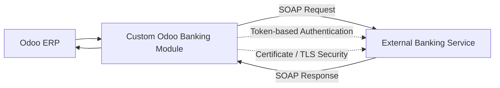

# odoo-secure-bank-integration
Private Odoo banking gateway integration demonstrating secure architecture, SOAP communication, and enterprise-grade authentication.

---

# Odoo Secure Banking Gateway Integration

This repository provides high-level documentation for a secure banking gateway integration implemented for Odoo ERP.

The actual source code, configurations, and sensitive assets are intentionally excluded due to banking security policies and NDA constraints.

---

## Overview

The project involves designing and implementing a secure, provider-agnostic banking gateway module for Odoo ERP.
The integration focuses on transaction status inquiry using SOAP-based communication with an external banking service.

---

## High-Level Architecture

---

## Key Responsibilities

Architecture design for secure banking integration within Odoo.

Implementation of a provider-agnostic gateway layer.

SOAP-based communication for transaction status inquiry.

Token-based authentication mechanisms.

Certificate-based secure communication (TLS).

Secure handling of sensitive credentials and cryptographic keys.

Error handling, logging, and reconciliation flow design.

Compliance with enterprise banking security requirements.

---

## Technologies

Odoo ERP (Python)

SOAP Web Services

Token-based Authentication

Certificate-based TLS Security

PostgreSQL

---

## Security & Confidentiality Notice

This repository intentionally excludes:

Bank names

Service endpoints

Credentials and access tokens

Cryptographic keys and certificates

Source code and configuration files

The full implementation remains private in accordance with security policies and non-disclosure agreements (NDA).

---

## Interview Notes

The complete implementation details, architectural decisions, and security considerations can be discussed during technical interviews.

---

## 📢 Author

👩‍💻 **Melika Mehranpour**  
Full Stack .NET Developer | ERP & Odoo Integrations | Agile & Scrum 

🔗 [LinkedIn](https://www.linkedin.com/in/melika-mehranpour-41b627161/) | [GitHub](https://github.com/MelikaWorks) | [Portfolio](https://github.com/MelikaWorks/Portfolio)

